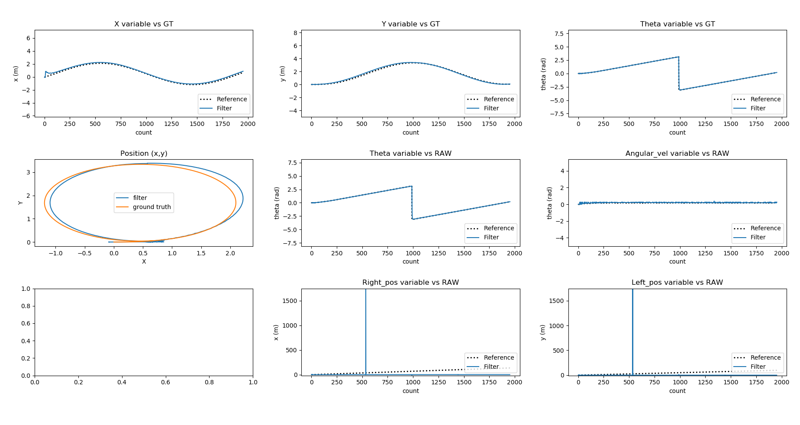

# Kalman Filter
A Kalman filter was developed for the Dingo-D Clearpath Robotics' differential robot to accurately estimate its pose (x, y, theta) within its environment. This control-based Kalman filter, comprising 9 states, leverages the robot's wheels' linear and angular velocities. Additionally, it incorporates measurements from the IMU sensor, specifically the x and y accelerations, total acceleration, and heading.

## Calculs of the Filter

## Results

